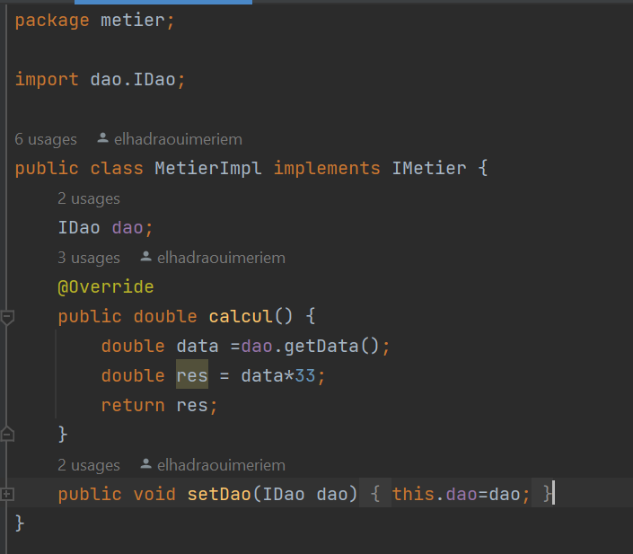

<h1>Inversion de Contrôle et Injection des dépendances</h1>
<h2>Introduction</h2>

 Inversion de controle(IOC): Permet au développeur de se concentrer exclusivement sur
le code métier (exigences fonctionnelles),tandis que c'est le framework qui prend en 
charge le code technique (exigences techniques). 
L'injection de dépendances(DI): est une pratique qui contribue à créer des
applications plus flexibles, modulaires, et faciles à maintenir en séparant
la création et la gestion des dépendances du code métier principal. 
Elle est couramment utilisée dans le développement logiciel, en particulier 
dans les applications basées sur des cadres de travail tels que Spring (pour Java).

<h2>Enoncé</h2>
<ol>
  <li>Couche DAO
    <ul>
      <li>a- Créer l'interface</li>
      <li>b- Créer l'interface b</li>
    </ul>
  </li>
  <li>Couche Métier
    <ul>
     <li>a- Créer l'interface IMetier</li>
     <li>b-Créer l'implémentation de IMetier</li>
   </ul>
  </li>
  <li>Couche Présentation
    
Créer une application qui permet de faire l'injection des dépandences

      <ul>
        <li>a- Instantiation statique</li>
        <li>b- Instantiation dynamique</li>
        <li>c-En utilisant Spring Framework
            <ul>
                <li>version XML</li>
                <li>version Annotation</li>
            </ul>
        </li>
        </ul>
  </li>
</ol>
<h2>Conception</h2>
<h3>Couplage faible </h3>

Pour garantir un couplage faible dans nos conceptions, nous devons utiliser des interfaces. 
Par exemple, prenons une classe DaoImpl qui implémente l'interface IDao, ainsi qu'une classe MetierImpl
qui implémente l'interface `IMetier`. 

Si la classe `MetierImpl` est associée à l'interface `IDao`, on peut dire que la classe `MetierImpl` 
et toute classe implémentant `IDao` sont liées par un couplage faible.

En d'autres termes, la classe `MetierImpl` peut fonctionner avec n'importe quelle classe qui
implémente l'interface `IDao`. En réalité, `MetierImpl` ne connaît que l'interface `IDao`. 
Cela signifie qu'il est possible d'associer `MetierImpl` à n'importe quelle classe qui 
implémente cette interface, sans nécessiter la moindre modification dans le code de `MetierImpl`.

Lorsque nous adoptons un couplage faible, nous favorisons la création d'applications qui sont
"fermées à la modification" (nous n'avons pas besoin de modifier les classes existantes) 
et "ouvertes à l'extension" (nous pouvons ajouter de nouvelles classes qui implémentent 
l'interface sans perturber le fonctionnement des classes existantes).

<h2>création de l'interface IDao</h2>

<h2>création d'implémentation de l'interface IDao avec la Version capteur</h2>

<h2>création d'implémentation de l'interface IDao avec la Version base de données</h2>

<h2>création d'implémentation de l'interface IDao avec la Version site web</h2>

<h2>création l'interface IMetier</h2>

<h2>création d'implémentation de l'interface IMetier</h2>

<h2>Instantiation statique</h2>

<h2>Instantiation dynamique</h2>

<h2>L'injection des dépandences avec Spring Framework version XML</h2>

<h2>L'injection des dépandences avec Spring Framework version annotaions</h2>

