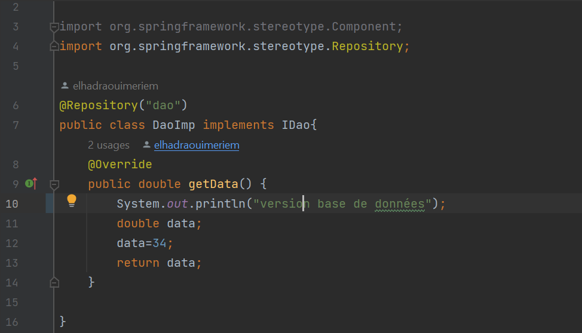

<h1>Inversion de Contrôle et Injection des dépendances</h1>
<h2>Introduction</h2>

 Inversion de controle(IOC): Permet au développeur de se concentrer exclusivement sur
le code métier (exigences fonctionnelles),tandis que c'est le framework qui prend en 
charge le code technique (exigences techniques). 
L'injection de dépendances(DI): est une pratique qui contribue à créer des
applications plus flexibles, modulaires, et faciles à maintenir en séparant
la création et la gestion des dépendances du code métier principal. 
Elle est couramment utilisée dans le développement logiciel, en particulier 
dans les applications basées sur des cadres de travail tels que Spring (pour Java).

<h2>Enoncé</h2>
<ol>
  <li>Couche DAO
    <ul>
      <li>a- Créer l'interface</li>
      <li>b- Créer l'interface b</li>
    </ul>
  </li>
  <li>Couche Métier
    <ul>
     <li>a- Créer l'interface IMetier</li>
     <li>b-Créer l'implémentation de IMetier</li>
   </ul>
  </li>
  <li>Couche Présentation
    
Créer une application qui permet de faire l'injection des dépandences

      <ul>
        <li>a- Instantiation statique</li>
        <li>b- Instantiation dynamique</li>
        <li>c-En utilisant Spring Framework
            <ul>
                <li>version XML</li>
                <li>version Annotation</li>
            </ul>
        </li>
        </ul>
  </li>
</ol>
<h2>Conception</h2>
<h3>Couplage faible </h3>

Pour garantir un couplage faible dans nos conceptions, nous devons utiliser des interfaces. 
Par exemple, prenons une classe DaoImpl qui implémente l'interface IDao, ainsi qu'une classe MetierImpl
qui implémente l'interface `IMetier`. 

Si la classe `MetierImpl` est associée à l'interface `IDao`, on peut dire que la classe `MetierImpl` 
et toute classe implémentant `IDao` sont liées par un couplage faible.

En d'autres termes, la classe `MetierImpl` peut fonctionner avec n'importe quelle classe qui
implémente l'interface `IDao`. En réalité, `MetierImpl` ne connaît que l'interface `IDao`. 
Cela signifie qu'il est possible d'associer `MetierImpl` à n'importe quelle classe qui 
implémente cette interface, sans nécessiter la moindre modification dans le code de `MetierImpl`.

Lorsque nous adoptons un couplage faible, nous favorisons la création d'applications qui sont
"fermées à la modification" (nous n'avons pas besoin de modifier les classes existantes) 
et "ouvertes à l'extension" (nous pouvons ajouter de nouvelles classes qui implémentent 
l'interface sans perturber le fonctionnement des classes existantes).

<h2>création de l'interface IDao</h2>

<h2>création d'implémentation de l'interface IDao avec la Version capteur</h2>

<h2>création d'implémentation de l'interface IDao avec la Version base de données</h2>

<h2>création d'implémentation de l'interface IDao avec la Version site web</h2>

<h2>création l'interface IMetier</h2>

<h2>création d'implémentation de l'interface IMetier</h2>

<h2>Instantiation statique</h2>

<h2>Instantiation dynamique</h2>

<h2>L'injection des dépandences avec Spring Framework version XML</h2>
<h3> fichier config.xml</h3>

<h3> Presentation avec Spring XML</h3>

Dans le processus d'injection de dépendances à l'aide d'un fichier XML, 
après avoir installé les trois dépendances nécessaires (spring-core, spring-context,
spring-beans) dans notre projet Maven, la partie de configuration se déroule dans le 
fichier "config.xml" situé dans les ressources. Ce fichier XML est utilisé comme un 
paramètre pour initialiser un contexte Spring, qui est une partie essentielle de notre application.

Le rôle de chaque dépendance est le suivant :

spring-core maven dependency: Cela fournit les fonctionnalités de base du framework Spring,
y compris la gestion des cycles de vie des objets, la configuration XML, et l'inversion de contrôle (IoC) de base.

spring-context maven dependency: Cette dépendance étend les capacités de Spring Core en 
fournissant un contexte d'application plus riche. Il offre des fonctionnalités avancées 
telles que la gestion des beans, la résolution de dépendances, et la configuration
d'applications plus complexes.

spring-beans maven dependency: Cette dépendance inclut les fonctionnalités liées aux
beans Spring, ce qui signifie la gestion des objets qui sont gérés par le conteneur 
Spring. Elle offre des fonctionnalités telles que la définition de beans, la configuration 
de leurs propriétés et la gestion de leur cycle de vie.

En exécutant la ligne de code suivante :

ApplicationContext springContext = new ClassPathXmlApplicationContext("config.xml");
Nous créons un contexte Spring en chargeant la configuration définie dans "config.xml".
Ce contexte sera utilisé pour initialiser et gérer les objets de notre application. 
C'est la première opération qui se produit après le lancement de notre application,
et elle permet d'instancier et de configurer les beans définis dans le fichier XML,
créant ainsi l'environnement 
d'exécution de notre application Spring.

<h2>L'injection des dépandences avec Spring Framework version annotaions</h2>
<h3> Repository</h3>

@Repository : Cette annotation est utilisée pour indiquer que la classe est
un composant de persistance, généralement utilisé pour les accès aux données. 

<h3> Service</h3>

@Service : Cette annotation est utilisée pour marquer une classe en tant que service.
Les classes de service contiennent la logique métier de l'application. 
Les classes annotées avec @Service sont découvertes et gérées par Spring.

<h3> Controller</h3>

@Controller : Cette annotation est utilisée pour marquer une classe en tant 
que contrôleur dans le contexte Spring MVC.  

